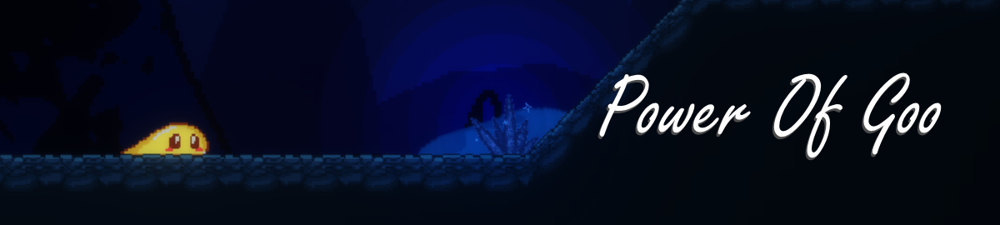

## Power Of Goo (Student Project)
 
- Homepage: https://power-of-goo.school4games.net
- Itch Page: https://s4g.itch.io/power-of-goo

#### 2D Platformer / Metroidvania made in Godot 3.5-stable Engine

Power of Goo is a 2D Pixel Art Platformer / Metroidvania in which 
the player progresses through various levels, facing different obstacles, 
be it environmental or a hazardous enemy. 
The player will obtain new abilities throughout the playthrough 
which they will need to access new areas.

#### Gameplay
- Navigate through an open world.
- Use your knowledge against the enemies you fight.
- Learn new skills that will allow you to advance to once unreachable places.
- Free your fellow slimes from captivity.

#### Roles
- Gameplay and AI Programmer
- UI/UX Design
- VFX Artist
- SFX Design

#### Engine / Languages
- Godot, GDScript

#### Responsibilities
- Implemented Player Movement that is easily editable for designers via Inspector values
- Implemented the combat mechanics of the game
- Wrote a custom made, modular state machine for Enemy AI to use
  - Co-Designed and implemented a boss fight
- Implemented a dialogue-system, used for the game's tutorial
- Designed and implemented a menu-screenflow
  - Implemented an options menu

#### Documentation
- [Screen-/UX-Flow](https://drive.google.com/file/d/1CAZHeZkz3Me97VWSmO2hGVYCRenWKKWt/view?usp=sharing)
